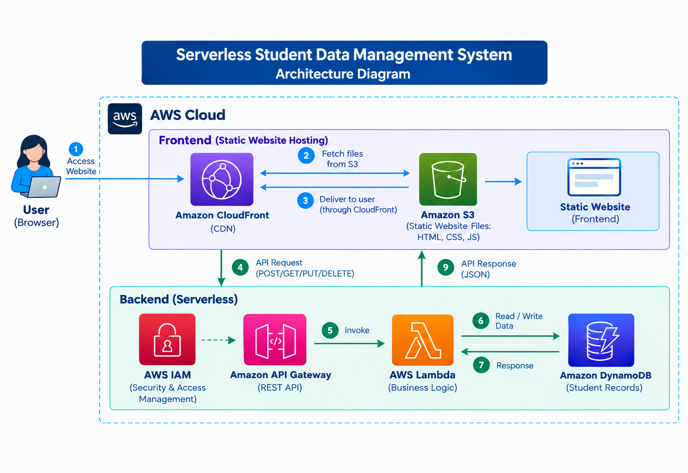
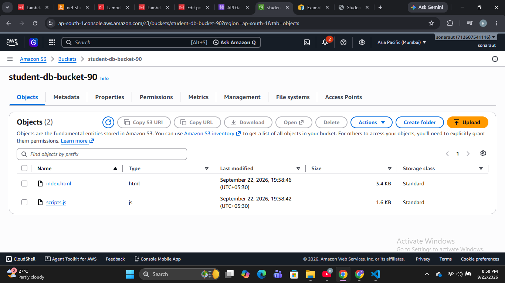
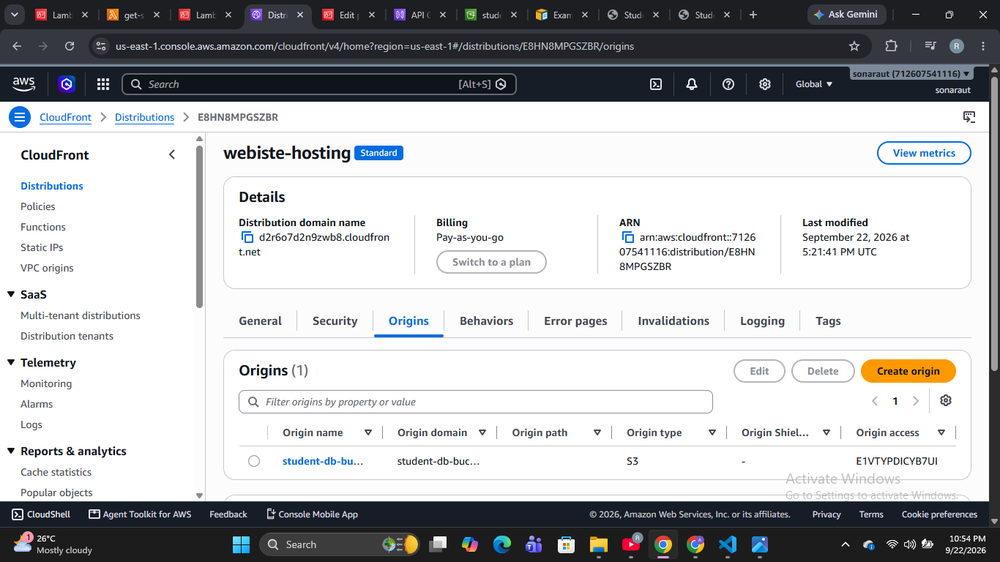
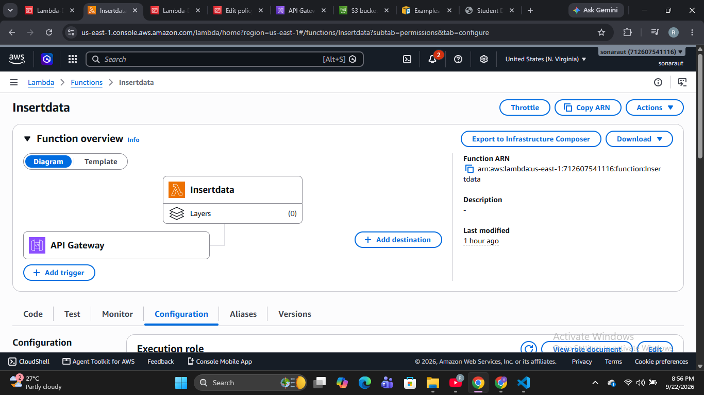
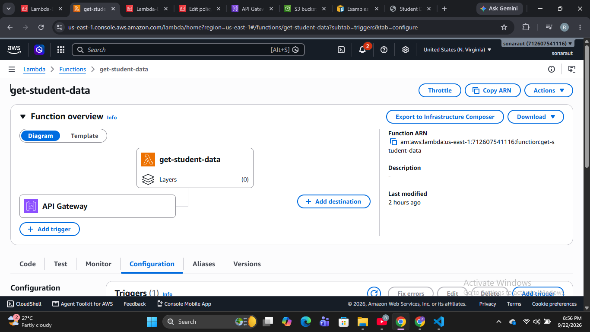
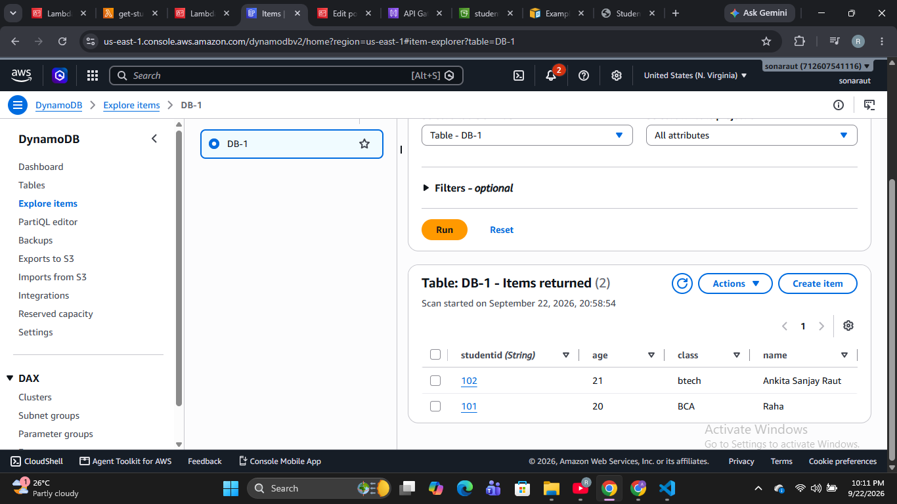
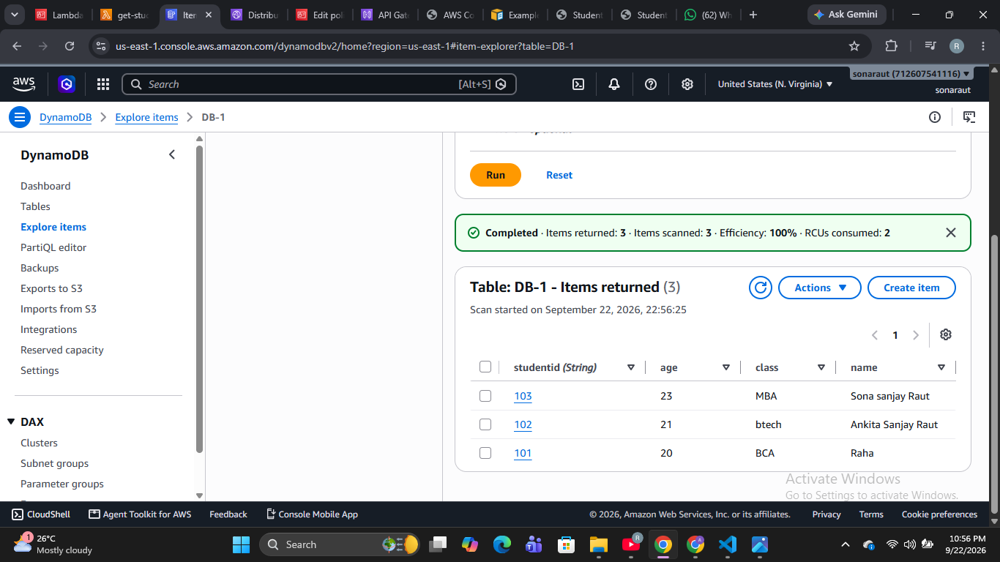
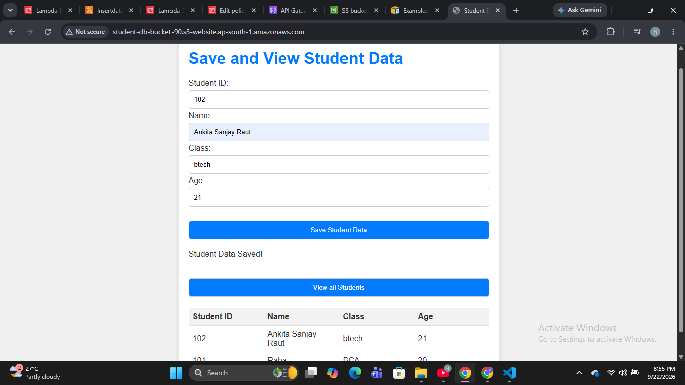

# Serverless Student Data Management System

This project demonstrates a **serverless student data management application deployed on AWS**.
The application uses a fully serverless architecture with **Amazon S3, CloudFront, API Gateway, AWS Lambda, DynamoDB, and IAM**.
The architecture is designed for **scalability, high availability, and zero server management**.

---

## Architecture Diagram

![Serverless Student Data Management System Architecture]


---

## Project Overview

The **Serverless Student Data Management System** is a web application that allows users to submit and manage student information through a web-based interface.

The application follows a **serverless architecture**, where AWS managed services handle frontend hosting, API requests, backend processing, and database operations.

Student data is submitted through the frontend and stored in **Amazon DynamoDB** using **API Gateway and AWS Lambda**.

---

## Architecture Flow

```text
User
  ↓
CloudFront
  ↓
Amazon S3
  ↓
Static Website / Frontend
  ↓
API Gateway
  ↓
AWS Lambda
  ↓
Amazon DynamoDB
  ↓
API Response
  ↓
Frontend
```

**AWS IAM** is used to control permissions and access between AWS services.

---

## AWS Services Used

The following AWS services were used in this project:

* **Amazon S3**
* **Amazon CloudFront**
* **Amazon API Gateway**
* **AWS Lambda**
* **Amazon DynamoDB**
* **AWS IAM**

---

## Architecture Components

### Amazon S3

Amazon S3 is used to store the **static frontend files** of the application.

The frontend contains:

* HTML
* JavaScript
* Student data form



CloudFront is used to deliver these files to users.

---

### Amazon CloudFront

Amazon CloudFront acts as the **Content Delivery Network (CDN)** for the frontend application.

Users access the website through CloudFront, while the static website files are stored in Amazon S3.

```text
User
 ↓
CloudFront
 ↓
S3
 ↓
Frontend Files
```

CloudFront helps deliver static content through AWS edge locations.

---

### Amazon API Gateway
Amazon API Gateway provides the **REST API** for the application.

The frontend sends HTTP requests to API Gateway when student data needs to be submitted or retrieved.

Example:

```text
Frontend
   ↓
API Request
   ↓
API Gateway
```


---

### AWS Lambda

AWS Lambda is used as the **serverless backend**.

Lambda functions process API requests received from API Gateway and communicate with DynamoDB.

```text
API Gateway
      ↓
AWS Lambda
      ↓
DynamoDB
```



No EC2 server is required to run the backend.



---

### Amazon DynamoDB
Amazon DynamoDB is used as the **NoSQL database** for storing student records.

Lambda performs database operations to store and retrieve student information.

```text
Lambda
  ↓
DynamoDB
  ↓
Student Records

```





---

### AWS IAM

AWS IAM is used to manage **permissions and access control** for AWS resources.

IAM roles and policies allow AWS services to access only the resources required by the application.

Example:

```text
Lambda
   ↓
IAM Role
   ↓
DynamoDB Permissions
```

This follows the principle of **least-privilege access**.


---
### OUTPUT




---

## Application Flow

### Step 1 — User Accesses Website

The user opens the student data website in a browser.

```text
User
 ↓
CloudFront
```

### Step 2 — CloudFront Fetches Frontend

CloudFront retrieves the static website files from Amazon S3.

```text
CloudFront
 ↓
S3
```

### Step 3 — Website Delivered to User

CloudFront delivers the HTML, CSS, and JavaScript files to the user's browser.

### Step 4 — User Submits Student Data

The user enters student information in the frontend form.

```text
Frontend
 ↓
API Request
```

### Step 5 — API Gateway Receives Request

The request is sent to the REST API configured in Amazon API Gateway.

```text
Frontend
 ↓
API Gateway
```

### Step 6 — Lambda Processes Request

API Gateway invokes the AWS Lambda function.

```text
API Gateway
 ↓
Lambda
```

### Step 7 — DynamoDB Stores Data

Lambda processes the request and stores or retrieves student information from DynamoDB.

```text
Lambda
 ↓
DynamoDB
```

### Step 8 — Response Returned

The result is returned through API Gateway to the frontend.

```text
DynamoDB
 ↓
Lambda
 ↓
API Gateway
 ↓
Frontend
```


---

## Key Features

* Fully serverless architecture
* Static website hosting using Amazon S3
* Global content delivery using CloudFront
* REST API using API Gateway
* Serverless backend using AWS Lambda
* NoSQL database using DynamoDB
* Student data storage and retrieval
* IAM-based access control
* Automatic scalability
* No server management required

---

## Security

Security is implemented using AWS IAM.

* IAM roles are used for AWS service access
* Lambda permissions are controlled using IAM policies
* AWS resources are accessed according to required permissions
* Least-privilege access is implemented where applicable

---

## Scalability

The application uses managed AWS serverless services.

* CloudFront handles content delivery at scale
* API Gateway handles API requests
* Lambda automatically scales based on incoming requests
* DynamoDB provides scalable NoSQL data storage

No EC2 server or traditional backend server needs to be manually managed.

---

## Project Steps

1. Create an S3 bucket
2. Upload static frontend files to S3
3. Configure frontend hosting
4. Create a CloudFront distribution
5. Configure API Gateway
6. Create AWS Lambda function
7. Configure Lambda integration with API Gateway
8. Create DynamoDB table
9. Configure Lambda permissions using IAM
10. Connect the frontend with API Gateway
11. Implement student data operations
12. Test the complete application

---

## Output

The final application allows users to submit student information through a web interface and store the data in DynamoDB.

```text
User
 ↓
CloudFront
 ↓
S3 Static Website
 ↓
API Gateway
 ↓
Lambda
 ↓
DynamoDB
```

---

## Learning Outcomes

This project helped me understand:

* Serverless architecture on AWS
* Amazon S3 static website hosting
* CloudFront CDN and content delivery
* REST API development using API Gateway
* AWS Lambda serverless computing
* DynamoDB NoSQL database
* IAM roles and permissions
* AWS service integration
* Serverless application design
* Automatic scalability
* Cloud architecture without server management

---

## Future Improvements

* Add Amazon Cognito for user authentication
* Add AWS WAF for additional web security
* Add CloudWatch monitoring and logging
* Implement CI/CD pipeline
* Add a custom domain using Route 53
* Implement automated deployment using AWS CodePipeline
* Add student search and filtering features

---

## Author

**Ankita Raut**

GitHub: https://github.com/AnkitaRaut177
